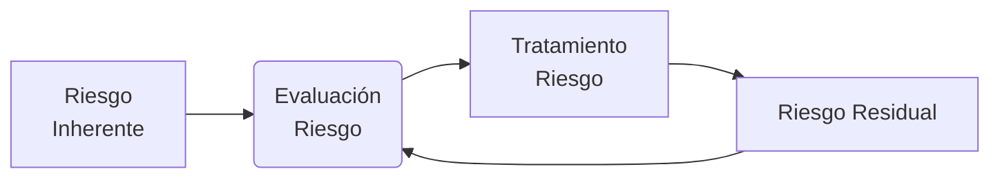

# Elementos de un SGSI
## Alcance del SGSI
El alcance describe la extensión y los límites del SGSI. Se trata de la selección de los elementos críticos que se deben proteger.
## Política de Seguridad de la Información 
Declaración de la dirección y los objetivos de la organización en cuanto a la [[1.1. Elementos y conceptos de la seguridad de la información. Dimensiones.#Seguridad de la Información|seguridad de la información]]. Incluye las responsabilidades, la asignación de recursos y el compromiso de la alta dirección. 
## Organización de la Seguridad de la Información
Es el establecimiento de una estructura organizativa para la seguridad de la información, en donde se realiza la asignación de roles y responsabilidades específicas. 
## Gestión de Activos
Aquí se realiza la identificación y clasificación de los [[1.2. Activos de Información, Amenazas y Vulnerabilidades.#Activos de Información|activos de información]], junto con la implementación de medidas para proteger dichos activos.
## Gestión del Riesgo
Proceso de evaluación de riesgos de [[1.1. Elementos y conceptos de la seguridad de la información. Dimensiones.#^4213f6|SI]].
Proceso de tratamiento de riesgos de [[1.1. Elementos y conceptos de la seguridad de la información. Dimensiones.#^4213f6|SI]].
## Monitoreo
Definición de Indicadores sobre los controles.
Procedimientos de Auditorías internas y revisión de la conformidad.
# Procedimiento para la Creación de un SGSI
## Iniciación del Proyecto
- Obtener el compromiso de la alta dirección.
- Designar un equipo de gestión de la seguridad de la información.
## Definición del Alcance
- Determinar el alcance del SGSI (qué procesos, unidades, y activos están incluidos).
- Identificar las partes interesadas y sus necesidades.
## Análisis de Riesgos
- Identificar y evaluar los riesgos relacionados con la seguridad de la información.
- Realizar un análisis de impacto en el negocio.
## Desarrollo de la Política de Seguridad de la Información
- Crear y aprobar la política de seguridad de la información.
- Comunicar la política a toda la organización.
## Implementación de Controles
- Seleccionar e implementar controles de seguridad adecuados basados en el análisis de riesgos.
- Documentar los procedimientos y procesos de seguridad.
## Formación y Concientización
- Desarrollar e implementar programas de formación y concientización para empleados y partes interesadas.
- Asegurar que todos comprendan sus roles y responsabilidades en la seguridad de la información.
## Monitoreo y Revisión
- Establecer procedimientos para monitorear y revisar la eficacia del SGSI.
- Realizar auditorías internas y revisiones regulares.
## Mejora Continua
- Revisar y mejorar continuamente el SGSI basado en los resultados de auditorías, incidentes y cambios en el entorno de la organización.
# Identificación de Riesgos
![[Pasted image 20241027193203.png]]
# Análisis de Riesgos
![[Pasted image 20241027193234.png|400]]
# Evaluación del Riesgo
- $Riesgo=Impacto \times Probabilidad$
- **Capacidad de riesgo:** La cantidad objetiva de pérdida que una empresa puede tolerar sin poner en riesgo su existencia. Difiere del apetito de riesgo, el cual es una decisión de la dirección sobre cuánto es deseable.
# Tratamiento de Riesgos
Son tratados los riesgos que se encuentran por arriba del nivel aceptable, eligiendo entre una de las siguientes 4 opciones:
- **Mitigarlo:** Implantar los controles necesarios con el fin de que el nivel de riesgo disminuya a un punto que se encuentre bajo el límite aceptable.
- **Transferirlo:** Traspasar a terceros el riesgo con el fin que sean éstos quienes puedan reducir su impacto o gestionar el riesgo de mejor manera.
- **Evitarlo:** Tomar acciones tendientes a impedir que el riesgo se vuelva una realidad. Sustituyendo el activo o dejar continuar la actividad relacionada con el activo.
- **Aceptarlo**: No realizar ninguna acción que permita evitar que se produzca el riesgo. Cuando no es posible ejecutar ninguna de las otras acciones y la probabilidad es baja o medio-baja.

>[!success] **Apetito de riesgo:** Cantidad y tipo de riesgo que una entidad desea aceptar en la consecución de su misión.

# Ciclo del Riesgo

- **Riesgo Inherente:** El riesgo en ausencia de tratamiento.
- **Riesgo Residual:** Permanece después de haber ejecutado las respuestas a los riesgos.
# Controles de Seguridad

| **Según su naturaleza**          | **- Técnicos - Organizativos**                                                          |
| :------------------------------- | ------------------------------------------------------------------------------------------ |
| **Según el aspecto que abordan** | **- Reducción de Probabilidad - Reducción de Impacto - Reducción de los 2 aspectos** |
| **Según la finalidad**           | **- Preventivos - de Detección - Correctivos  - de Monitorización**               |
| **Riesgos Mitigados**            | **- Tecnológico - Operativo - Reputacional - Cumplimiento Legal**                 |
# Interacción entre componentes de un SGSI
![[Pasted image 20241028163024.png]]
